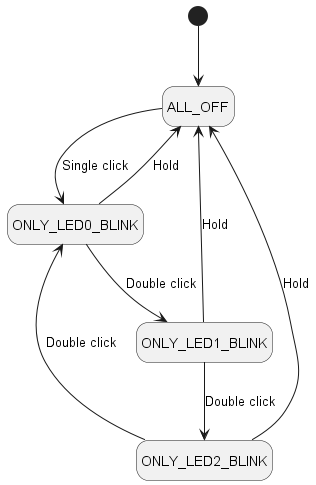
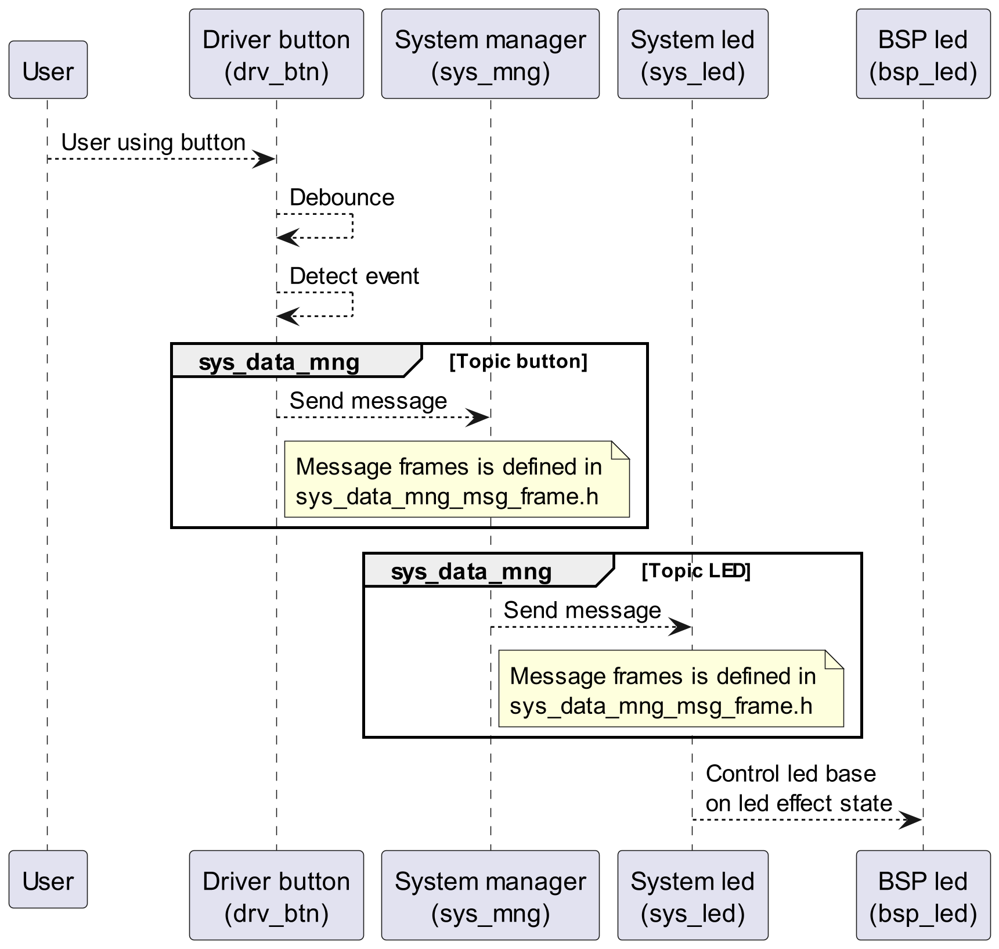
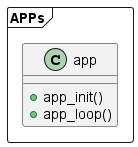
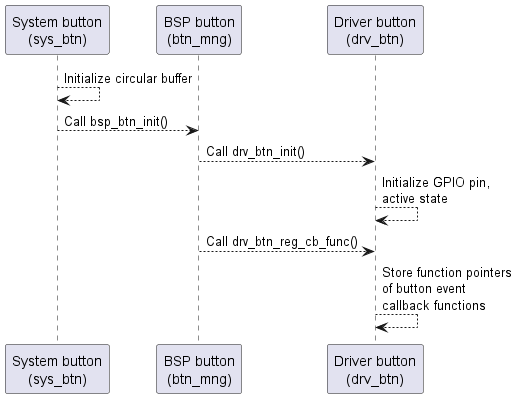
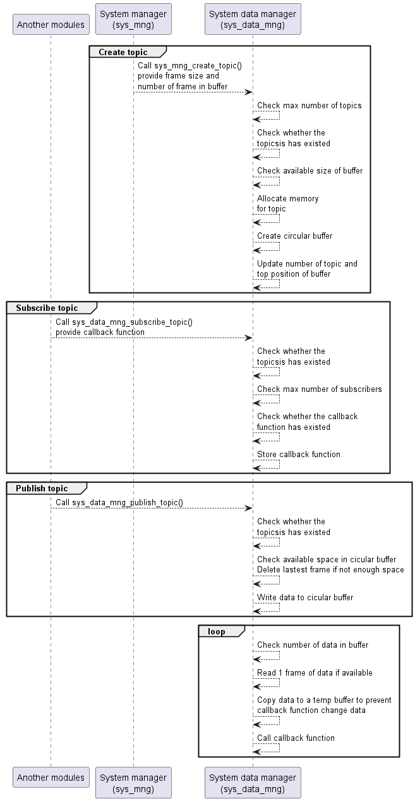
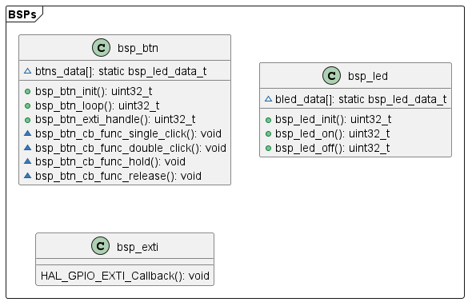

# **Table of contents**
- [**Table of contents**](#table-of-contents)
- [**1. About this project**](#1-about-this-project)
- [**2. System overview**](#2-system-overview)
  - [**2.1. LED effect state machine diagram**](#21-led-effect-state-machine-diagram)
  - [**2.2. Sequence diagram**](#22-sequence-diagram)
- [**3. System design**](#3-system-design)
  - [**3.1. Firmware architecture**](#31-firmware-architecture)
    - [**3.1.1. Application layer**](#311-application-layer)
    - [**3.1.2. System services layer**](#312-system-services-layer)
    - [**3.1.3. BSP layer**](#313-bsp-layer)
    - [**3.1.4. Middlewares layer**](#314-middlewares-layer)
    - [**3.1.5. Device drivers layer**](#315-device-drivers-layer)

# **1. About this project**
This project aims to create a led effect system that can change LEDs effect depend on a button controlled by users.

# **2. System overview**
## **2.1. LED effect state machine diagram**
System includes 1 button and 3 LEDs working as state machine below.

## **2.2. Sequence diagram**
Below is a sequence diagram demonstrating what system do when user push a button.

# **3. System design**
## **3.1. Firmware architecture**
Firmware of project use this firmware architecture model:

### **3.1.1. Application layer**

- **app**: Call init functions and loop functions of system service layers.

### **3.1.2. System services layer**

- **sys_mng**: Receive messages from all sources and transfer messages to the correct destinations depend on current state of the system.
- **sys_led**: Receive messages from system manager (sys_mng), run a state machine to control led effect.  
- **sys_btn**: Manage all buttons events from user and send button messages to system manager (sys_mng). A button initializing process is shown in sequence diagram below. 

- **sys_data_mng**: Provide method to send message between modules, another modules can receive messages by using subscribing for a topic that it need.

### **3.1.3. BSP layer**

- **bsp_exti**: Call a external interrupt handling function of drivers (E.g. Button driver (drv_btn)) in system's external interrupt callback function (HAL_GPIO_EXTI_Callback()).
- **bsp_btn**: Initialize button pin, button active state and register button events callback functions.
- **btn_led**: Initialize LED pin, LED active state and provide functions to turn LED on/off.

### **3.1.4. Middlewares layer**

- **cbuffer**: Circular buffer library.

### **3.1.5. Device drivers layer**

- **drv_btn**: Button driver includes 2 block:
  - Debouncing block: Debounce the input with 50ms debouncing time.
  
  - Handling block: Detect event from button (single click, double click, hold, release).
  
